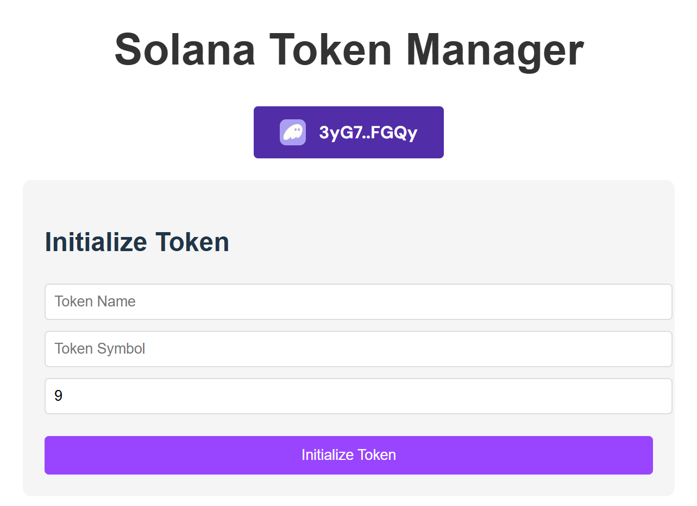

# Solana Token Manager

This project is a token management application based on the Solana blockchain, allowing users to connect, initialize tokens, mint, and transfer through wallets. The front-end uses React and Solana Wallet Adapter to integrate the Solana wallet, supporting the minting and transfer of tokens. The back-end uses the Anchor framework to develop Solana smart contracts, providing token initialization, minting, and transfer functions. The project implements basic functions such as token creation, issuance, and balance query, making it easier for developers and users to manage custom tokens on the Solana chain.

# How to run

On the content of app:

```
npm install
```

Then:

```
npm run dev
```

You may see something like this:
